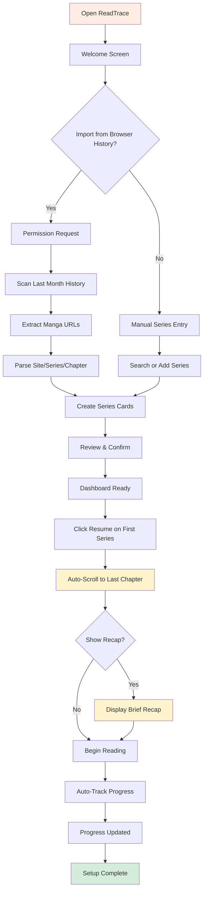
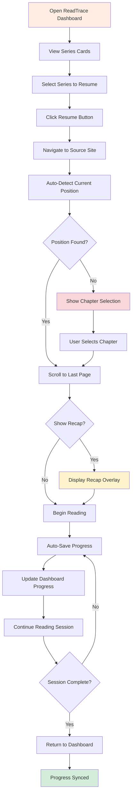
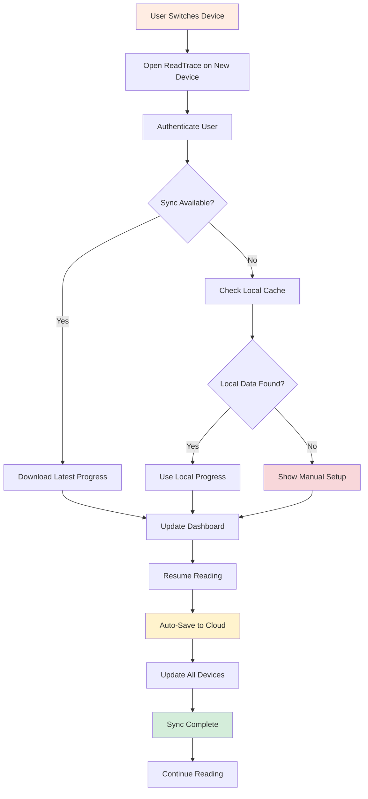
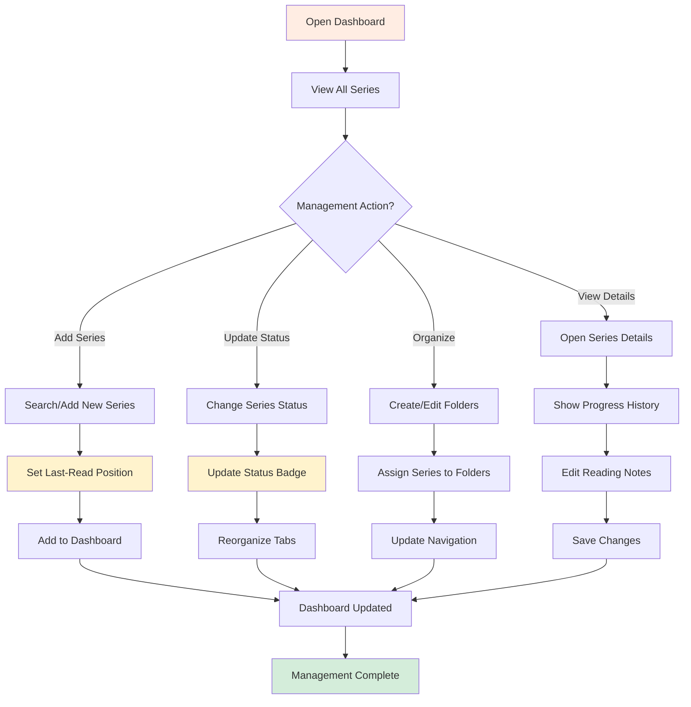
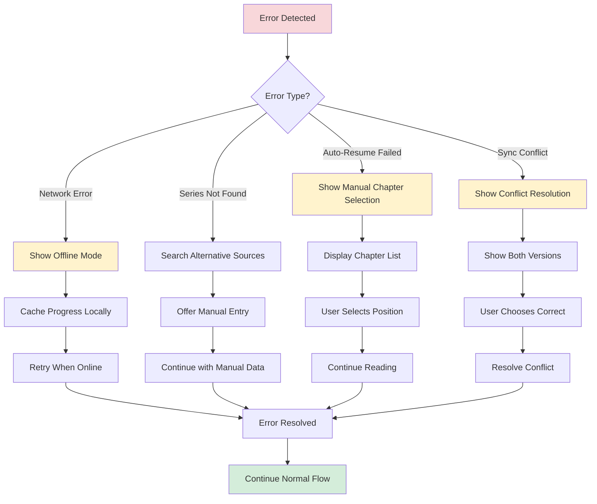

# UX Design Specification read_trace

**Author:** Lokki
**Date:** 2026-02-09

---

<!-- UX design content will be appended sequentially through collaborative workflow steps -->

## Executive Summary

### Project Vision

ReadTrace is a reading continuity system that transforms the cognitive burden of "where was I?" into seamless one-click story resumption for manga/manhwa consumers. Unlike traditional bookmark tools, ReadTrace treats reading continuity as a memory problem, automatically detecting progress across multiple platforms and preserving the narrative context needed for emotional reconnection to stories.

### Target Users

**Alex the Heavy Binger** (Age 22, student/early-career): Reads 30+ series across 5+ scan sites, experiences acute pain from lost continuity during binge sessions, needs automatic cross-platform tracking with minimal friction, values instant resume functionality and multi-device synchronization.

**Sam the Casual Returner**: Reads 3-10 series sporadically, primary pain point is emotional disconnection after long breaks leading to series abandonment, values contextual recaps and "previously on..." summaries that bridge memory gaps.

**Jordan the Community Reader**: Engages heavily in forums and Discord, needs progress tracking for spoiler avoidance, values tagging features and community visibility of reading habits, drives adoption through social proof.

### Key Design Challenges

**Cross-Platform Continuity** - Users switch between desktop/mobile and multiple scan sites, creating fragmented reading states that need seamless synchronization across devices and platforms.

**Contextual Memory Preservation** - The emotional connection to stories fades over time, requiring intelligent recap systems that bridge memory gaps without overwhelming users or disrupting reading flow.

**Minimal Friction Onboarding** - Heavy readers are desperate for solutions but wary of complex setup, requiring value delivery in under 2 minutes with effortless browser extension integration.

### Design Opportunities

**One-Click Continuity** - The "resume exactly where I left off" moment creates instant delight and competitive advantage, transforming the mental effort of returning to stories into effortless re-engagement.

**Intelligent Context Delivery** - AI-powered recaps that adapt to time away and reading patterns could become the core differentiator, preserving emotional continuity and preventing series abandonment.

**Visual Series Management** - A dashboard that transforms chaotic multi-site reading into an organized, stress-free library experience, providing clarity and control over fragmented reading habits.

## Core User Experience

### Defining Experience

ReadTrace's core experience is **effortless reading continuity** - users resume any series exactly where they left off, across any supported platform, without thinking about tracking or bookmarks. The product becomes invisible assistance that preserves narrative flow and emotional connection to stories.

The defining loop: Open dashboard → Click series → Resume exactly where left off → Reading automatically tracked → Return anytime with full context.

### Platform Strategy

**Primary Platform:** Browser extension + web dashboard (desktop-first)
**Input Method:** Mouse/keyboard for desktop, touch for future mobile
**Constraints:** Must work with 2-3 key scanlation platforms initially, avoid anti-scraping sites
**Offline Capability:** Local storage for last-read positions, cloud sync for cross-device continuity
**Device Leverage:** Browser storage APIs, cross-domain communication, lightweight cloud authentication

### Effortless Interactions

**Zero-Thought Actions:**

- Single-click resume to exact chapter and scroll position
- Automatic progress detection without user intervention
- Dynamic dashboard updates reflecting real-time reading state
- Contextual recap display when returning after breaks

**Eliminated Friction:**

- No manual bookmark saving or management
- No spreadsheet tracking or mental note-taking
- No repeated site logins or platform switching
- No "where was I?" cognitive burden

### Critical Success Moments

**First Resume Success:** User clicks resume and lands exactly where they left off - creates instant trust and "aha!" moment

**Dashboard Clarity Moment:** User sees all their series organized with accurate progress - feels in control and sees immediate value

**Contextual Recap Moment:** User returns after weeks and gets perfect story context - prevents abandonment and preserves emotional continuity

**Cross-Device Magic Moment:** User switches from desktop to mobile and continuity is seamless - feels magical and indispensable

**Make-or-Break Flows:**

1. Series addition → automatic progress tracking
2. Series resumption → exact position restoration  
3. Break return → contextual recap delivery
4. Library overview → clear series management

### Experience Principles

**Continuity First** - Every design decision preserves reading flow and eliminates mental friction between sessions

**Invisible Assistance** - Progress tracking happens automatically in the background, requiring zero user thought or effort

**Instant Gratification** - One-click resume delivers immediate value, building trust and habit formation from first use

**Cross-Platform Seamlessness** - Users forget which device or site they're using because continuity just works everywhere

## Desired Emotional Response

### Primary Emotional Goals

**Relief and Trust** - The core emotional foundation where users feel their mental load is lifted and have complete confidence that their reading continuity is preserved effortlessly. This transforms the cognitive burden of "where was I?" into calm assurance that stories are always accessible.

**Confidence and Control** - Users feel empowered and in control of their fragmented reading habits, with clear visibility across all series and platforms without feeling overwhelmed.

**Delight and Accomplishment** - Subtle moments of delight through intelligent recaps and smooth interactions, combined with the satisfaction of maintaining reading habits without abandonment.

### Emotional Journey Mapping

**Discovery & Onboarding:** Excited, curious, confident - Quick 2-minute setup with immediate "aha" moment when first series tracks automatically

**Core Reading Experience:** Calm, focused, relief - Invisible progress tracking that requires zero thought, allowing complete immersion in stories

**Return After Break:** Trust, satisfaction, relief - Contextual recaps refresh memory seamlessly, dashboard provides clarity without stress

**Session Completion:** Accomplishment, delight - Visual progress feedback and smooth transitions reinforce successful reading habits

**Error Recovery:** Mild reassurance, trust maintained - Graceful error handling preserves confidence and prevents lost progress anxiety

**Returning Users:** Confidence, habit-forming comfort - Seamless continuity reinforces "I don't have to worry" emotional safety

### Micro-Emotions

**Confidence vs. Confusion:** Critical priority - Clear dashboard design and predictable interactions prevent user disorientation

**Trust vs. Skepticism:** Essential foundation - Reliable auto-save and accurate resume functionality build unwavering user confidence

**Relief vs. Frustration:** Core experience - Every interaction should feel effortless, eliminating the mental friction of manual tracking

**Delight vs. Satisfaction:** Memorable differentiator - Intelligent recaps and smooth animations create shareable moments of delight

**Accomplishment vs. Frustration:** Habit reinforcement - Visual progress indicators celebrate continued reading without adding pressure

### Design Implications

**For Confidence/Trust:** Instant auto-save feedback, accurate cross-platform resume, clear dashboard visuals, transparent progress tracking

**For Relief/Calm:** Minimal click interactions, invisible background tracking, unobtrusive recap summaries, zero-setup continuation

**For Delight/Surprise:** Subtle transition animations, contextual "Previously on..." recaps, progress celebration micro-interactions

**For Accomplishment:** Clear series progress visualization, reading session feedback, habit continuity indicators

**For Excitement/Curiosity:** Optional reading insights, series discovery features, personalized reading statistics (deferred to post-MVP)

### Emotional Design Principles

**Relief-First Design** - Every interaction should reduce cognitive load and eliminate the mental burden of reading continuity

**Trust-Building Reliability** - The system must never fail silently; transparency and accuracy build unwavering user confidence

**Delight in Subtlety** - Small, intelligent touches create memorable moments without disrupting the core reading experience

**Confidence Through Clarity** - Users should always feel in control and understand their reading state without mental effort

## UX Pattern Analysis & Inspiration

### Inspiring Products Analysis

**Notion** - Unified workspace with visual hierarchy and seamless organization. Heavy users love the clear dashboard overview and drag-and-drop functionality. Key lessons: dashboard clarity matters, autosave builds trust, minimalist design supports focus.

**Pocket/Instapaper** - Cross-device content saving with minimal friction. Users value instant save functionality and offline reliability. Key lessons: quick save/resume flows are essential, low onboarding friction creates instant gratification, offline support provides robustness.

**Goodreads** - Reading progress tracking with visual progress indicators and optional social features. Users respond to progress bars and achievement systems. Key lessons: visual progress motivates users, dashboard categorization provides clarity, series covers improve recognition.

**Spotify/Netflix** - Seamless cross-device continuity where users start on one device and continue on another. Creates trust and habit formation through reliable state synchronization.

### Transferable UX Patterns

**Navigation Patterns:**

- Notion-style dashboard hierarchy - perfect for ReadTrace's multi-series overview, giving immediate clarity across fragmented reading habits
- Pocket's minimal list navigation - solves ReadTrace's challenge of making series resumption effortless without overwhelming users

**Interaction Patterns:**

- Spotify/Netflix cross-device continuity - excellent for ReadTrace's core goal of seamless platform switching
- Goodreads progress visualization - addresses ReadTrace's need for visual feedback that reinforces reading habits

**Visual Patterns:**

- Notion's minimalist, high-contrast design - supports ReadTrace's emotional goal of relief and calm
- Pocket's content-focused layout - aligns with ReadTrace's platform requirements of distraction-free reading support

### Anti-Patterns to Avoid

**Complex manual categorization systems** - users find this confusing/frustrating, conflicts with ReadTrace's relief-first design

**Heavy social features upfront** - creates unnecessary friction for MVP, doesn't align with core continuity goals

**Over-complicated dashboards** - doesn't support ReadTrace's emotional goal of calm and confidence

**Manual bookmark management** - users abandon tools that require ongoing manual effort

### Design Inspiration Strategy

**What to Adopt:**

- Notion's dashboard clarity - supports ReadTrace's core experience of multi-series visibility
- Pocket's instant save/resume flow - aligns with ReadTrace's user need for effortless continuity
- Spotify/Netflix cross-device sync - delivers ReadTrace's critical success moment of seamless continuity

**What to Adapt:**

- Goodreads progress visualization - modify for ReadTrace's unique requirements of chapter/page level tracking
- Notion's minimalist design - simplify further for ReadTrace's focused reading continuity use case

**What to Avoid:**

- Complex social features - conflicts with ReadTrace's relief-first emotional goals
- Manual categorization overhead - doesn't fit ReadTrace's invisible assistance principle

## Design System Foundation

### Design System Choice

**Tailwind CSS + shadcn/ui** - Themeable system approach that balances speed to market with visual flexibility, perfectly aligned with ReadTrace's minimalist, calm emotional goals and existing Next.js tech stack.

### Rationale for Selection

**Speed and Consistency:** Already in the tech stack, minimizing learning curve while providing proven components and patterns for rapid MVP development

**Emotional Alignment:** Excellent for minimalist, calm design that supports relief and trust emotions through clean spacing, subtle typography, and controlled visual hierarchy

**Brand Flexibility:** Highly customizable for unique brand identity while maintaining component consistency, allowing future growth without rewrites

**Technical Fit:** Perfect alignment with Next.js architecture, browser extension requirements, and cross-platform dashboard needs

### Implementation Approach

**Tailwind CSS Foundation:**

- Consistent spacing, typography, and responsive layout system
- Utility-first development for rapid iteration
- Design tokens for colors, spacing, and typography

**shadcn/ui Components:**

- Pre-built, composable components for dashboard, buttons, cards, modals
- Accessibility-ready patterns with minimal customization
- Focus on subtle animations and interaction feedback

**Customization Strategy:**

- Calm color palette: soft neutrals with orange accent for series highlights and resume actions
- Minimalist dashboard layout emphasizing series overview and resume functionality
- Micro-interactions: progress checkmarks, smooth transitions, recap fade-ins
- Component variations for different contexts (extension vs. dashboard)

### Customization Strategy

**Visual Identity:**

- Primary palette: Soft grays and whites for calm background
- Accent color: Orange variations for resume buttons, progress indicators, and interactive elements
- Typography: Clean, readable fonts supporting focus and reduced cognitive load

**Component Customization:**

- Dashboard components optimized for series visibility and quick resume actions
- Extension components designed for minimal intrusion during reading
- Responsive patterns supporting desktop-first approach with future mobile expansion

**Interaction Design:**

- Subtle animations that delight without disrupting reading flow
- Progress visualization inspired by Goodreads but simplified for chapter/page tracking
- Cross-platform continuity patterns inspired by Spotify/Netflix seamless switching

## 2. Core User Experience

### 2.1 Defining Experience

**"Single-click resume with automatic last-read positioning and optional recap"** - The magical moment where users click any series and instantly return to their exact reading position, with intelligent context restoration for long breaks. This defining interaction replaces the cognitive burden of manual tracking with effortless continuity.

### 2.2 User Mental Model

**Current Mental Model:** Users expect unreliable manual tracking through bookmarks, spreadsheets, or memory - all requiring conscious effort and prone to failure

**Desired Mental Model:** "I can always pick up where I left off without thinking" - automatic, invisible assistance that eliminates mental load

**Frustration Points:** Lost progress across platforms, remembering last-read chapters, spoiler avoidance, complex setup processes

**Expectation:** Click → read → resume automatically, with intelligent context support when needed

### 2.3 Success Criteria

**"This Just Works" Moment:** Click series → auto-resume at exact position → optional contextual recap appears seamlessly

**Feeling Smart/Accomplished:** Dashboard provides clear series overview with automatic progress updates

**Instant Feedback:** Visual confirmations (scroll restoration, progress indicators, recap availability) validate correct tracking

**Automatic Behaviors:** Background progress saving, cross-device synchronization, intelligent recap delivery without user action

**Speed Requirements:** Complete resume flow under 2 seconds with minimal user interaction

### 2.4 Novel UX Patterns

**Familiar Foundation:** Click-to-open, scroll positioning, dashboard overview - patterns users already understand intuitively

**Innovative Enhancement:** Multi-platform continuity with contextual memory assistance creates "magical" reliability

**Combination Approach:** Merge established interactions with invisible intelligence (auto-save, sync, recaps) for effortless experience

### 2.5 Experience Mechanics

**1. Initiation Phase:**

- Dashboard presents clear series library with visual status indicators
- Orange resume buttons highlight continuation opportunities
- New chapter and break-return visual cues guide user attention

**2. Core Interaction:**

- Single click triggers immediate navigation to exact chapter and scroll position
- Conditional recap delivery for returns after extended breaks
- Background progress tracking continues automatically

**3. Feedback Systems:**

- Smooth scroll restoration confirms accurate positioning
- Real-time progress indicators validate tracking success
- Dismissible recap panels provide optional context without friction

**4. Completion Flow:**

- User seamlessly continues reading from exact position
- System maintains invisible progress tracking throughout session
- Cross-device synchronization ensures continuity across all platforms
- Dashboard reflects updated reading state automatically

## Visual Design Foundation

### Color System

**Primary Palette:**
- **Brand Orange:** #FF7A45 - Primary actions, resume buttons, main interactive elements
- **Background Cream:** #FFF8F2 - Main background, reduces eye strain for extended reading
- **Card Peach:** #FFEDE3 - Dashboard cards and panels, subtle visual separation
- **Text Charcoal:** #222222 - Primary text, high readability against light backgrounds
- **Text Gray:** #6C757D - Secondary metadata, chapter information, dates

**Accent & Feedback Colors:**
- **Progress Orange:** #FFC48C - Progress bars, micro-delights, completion indicators
- **Success Teal:** #3AB0FF - Success states, completion feedback, positive actions
- **Error Red:** #FF6B6B - Error states, warnings (used sparingly)
- **Disabled Gray:** #DADADA - Inactive elements, disabled states

**Semantic Mapping:**
- Primary actions: Brand Orange with hover state (#FF6A30)
- Background hierarchy: Cream base with Peach card overlays
- Text hierarchy: Charcoal primary with Gray secondary
- Progress feedback: Yellow-Orange fills with Teal completion
- Status indicators: Success Teal, Error Red, Disabled Gray

### Typography System

**Typeface Selection:**
- **Primary:** Inter family for modern, clean readability across all interfaces
- **Weights:** Regular (400) for body, Medium (500) for actions, Semi-bold (600) for headings
- **Rationale:** Inter's excellent readability supports extended reading sessions and quick scanning

**Type Scale:**
- **Headings/Series Titles:** Inter Semi-bold, 24-32px for dashboard hierarchy
- **Body/Metadata:** Inter Regular, 16px minimum for accessibility
- **Actions/Buttons:** Inter Medium, 14-16px for interactive elements
- **Line Height:** 1.5 for body text, 1.2 for headings

**Accessibility Standards:**
- Minimum 16px body text with 1.5 line height
- All color combinations meet 4.5:1 contrast ratios
- Clear visual hierarchy through size and weight variations

### Spacing & Layout Foundation

**Spacing System:**
- **Base Unit:** 8px grid system (8, 16, 24, 32px multiples)
- **Component Padding:** 16-24px for cards and panels
- **List Gaps:** 12-16px between series and chapter items
- **Section Margins:** 24-32px between major content areas

**Layout Principles:**
- **Visual Feel:** Airy and spacious to reduce cognitive load
- **Grid Structure:** 12-column responsive system for consistent alignment
- **White Space:** Generous spacing between sections, tighter spacing for related items
- **Content Density:** Moderate density supporting quick scanning without overwhelming

**Responsive Foundation:**
- Desktop-first approach with graceful mobile scaling
- Flexible grid system supporting various screen sizes
- Consistent spacing ratios maintained across breakpoints

### Accessibility Considerations

**Visual Accessibility:**
- WCAG 2.1 AA compliance through proper contrast ratios
- Semantic color combinations supported by text labels
- Clear focus indicators for keyboard navigation
- High contrast modes supported through color palette

**Interaction Accessibility:**
- Minimum 44px touch targets for mobile compatibility
- Clear hover and focus states for all interactive elements
- Consistent visual feedback for user actions
- Screen reader friendly semantic HTML structure

**Reading Accessibility:**
- Optimized line height and spacing for extended reading
- Reduced eye strain through warm background tones
- Clear typography hierarchy supporting content scanning
- Responsive text sizing maintaining readability

## Design Direction Decision

### Design Directions Explored

**Six Design Directions Generated:**
1. **Minimalist Dashboard** - Clean, focused, series-centric approach
2. **Card-Based Layout** - Visual, organized, scannable with gradients
3. **Detailed List View** - Information-rich with comprehensive metadata
4. **Compact Grid** - Space-efficient for power users
5. **Tabbed Interface** - Organized by status categories
6. **Magazine Style** - Editorial with cover images and hero sections

**Additional Direction Created:**
7. **Organized, Categorized Series Manager** - Enhanced tabbed interface with magazine-style image slots

### Chosen Direction

**Direction 7: Organized, Categorized Series Manager with Magazine-Style Image Slots**

This direction combines the best elements from multiple approaches:
- Tabbed organization for status-based categorization
- Magazine-style image slots for visual appeal
- Detailed metadata grid for comprehensive information
- Progress visualization and status badges
- Interactive elements with hover effects

### Design Rationale

**User Experience Alignment:**
- Supports both casual readers and power users through organized categorization
- Magazine-style images provide visual recognition and emotional connection
- Detailed metadata satisfies power user needs without overwhelming casual users
- Tabbed interface reduces cognitive load by focusing on relevant series

**Brand Alignment:**
- Maintains calm, focused aesthetic through orange-based color palette
- Magazine style adds editorial polish without disrupting reading flow
- Image slots create visual hierarchy and series recognition
- Spacious layout supports relief and confidence emotional goals

**Technical Feasibility:**
- Leverages established tab patterns users understand intuitively
- Image slots ready for real manga cover integration
- Responsive grid system adapts to different screen sizes
- Component-based approach aligns with Tailwind + shadcn/ui foundation

### Implementation Approach

**Core Components:**
- Tabbed navigation system (Reading, Completed, On Hold, Plan to Read)
- Detailed card layout with image slots (100px × 140px)
- Metadata grid showing platform, position, timestamps
- Progress bars with percentage completion
- Status badges with color-coded states

**Visual Design Elements:**
- Magazine-style image placeholders with gradient backgrounds
- Orange-based color palette with semantic color mapping
- Inter typography family for consistent readability
- 8px spacing system for consistent layout
- Hover effects and micro-interactions for engagement

**Responsive Strategy:**
- Desktop-first approach with mobile adaptation
- Flexible grid system for various screen sizes
- Card layout adapts to smaller screens
- Tab navigation remains accessible across devices

**Content Strategy:**
- Real manga data examples for authentic presentation
- Comprehensive metadata for power users
- Clear status indicators for quick scanning
- Progress visualization for motivation and tracking

## User Journey Flows

### 🎯 Journey 1: First-Time Setup & Series Addition

**Goal:** Users can onboard, add series, and start tracking with minimal friction, leading immediately to the core "resume where you left off" experience.

**Flow Diagram:**


### 🔄 Journey 2: Daily Reading Continuity

**Goal:** Seamless resume experience with automatic positioning and optional recaps.

**Flow Diagram:**


### 🌐 Journey 3: Cross-Platform Synchronization

**Goal:** Seamless reading experience across devices with automatic progress sync.

**Flow Diagram:**


### 📚 Journey 4: Series Management & Organization

**Goal:** Efficient management of multiple series with status tracking and organization.

**Flow Diagram:**


### 🔧 Journey 5: Error Recovery & Troubleshooting

**Goal:** Graceful handling of errors and helping users recover from issues.

**Flow Diagram:**


### 🎨 Journey Patterns

**Navigation Patterns:**
- **Tab-based Organization:** Reading/Completed/On Hold/Plan to Read
- **Card-based Actions:** Resume, View Details, Update Status
- **Breadcrumb Navigation:** Dashboard → Series → Chapter → Page

**Decision Patterns:**
- **Progressive Disclosure:** Show essential info first, details on demand
- **Smart Defaults:** Auto-detect position, suggest common actions
- **Error Recovery:** Always provide a path forward, never dead ends

**Feedback Patterns:**
- **Visual Progress:** Progress bars, completion percentages, status badges
- **Micro-interactions:** Hover effects, button states, loading indicators
- **Success Confirmation:** Checkmarks, toast notifications, dashboard updates

### 🚀 Flow Optimization Principles

**Minimize Steps to Value:**
- Browser history import eliminates manual series entry
- One-click resume from dashboard
- Automatic positioning eliminates navigation

**Reduce Cognitive Load:**
- Clear visual hierarchy with image slots
- Status-based organization reduces scanning
- Progressive disclosure of detailed information

**Create Moments of Delight:**
- Automatic series detection feels magical
- Seamless cross-device sync
- Visual progress tracking creates accomplishment

**Handle Edge Cases Gracefully:**
- Offline mode with local caching
- Multiple sources for series metadata
- Conflict resolution for sync issues

## Component Strategy

### Design System Components

**Available from Tailwind + shadcn/ui:**
- **Buttons:** Primary, secondary, ghost, outline variants with hover states
- **Cards:** Basic layouts with shadows, borders, and rounded corners
- **Tabs:** Navigation system with active/inactive states
- **Progress Bars:** Linear indicators with customizable styling
- **Badges:** Status indicators with color variants (orange, gray, red, green)
- **Inputs:** Text fields, search boxes, and dropdowns
- **Modals:** Dialog overlays for confirmations and permissions
- **Tooltips:** Hover information displays
- **Avatars:** Image and placeholder displays with fallbacks

**Foundation Components We'll Use:**
- Card base for SeriesCard container
- Button variants for ResumeButton and actions
- Badge system for status indicators
- Progress bar base for ProgressTracker
- Modal system for HistoryImporter and RecapOverlay

### Custom Components

#### SeriesCard Component

**Purpose:** Display each series with essential metadata, visual progress, and quick resume actions.

**Usage:** Primary component in dashboard tabs (Reading, Completed, On Hold, Plan to Read)

**Anatomy:**
- **Container:** Card with light border, subtle shadow, rounded corners
- **Image Slot:** 100px × 140px magazine-style cover image on left
- **Metadata Section:** Series title, genre tags, status badge, platform info
- **Action Section:** Resume button aligned top-right
- **Progress Section:** Linear progress bar with percentage

**States:**
- **Default:** Card with series information
- **Hover:** Border color changes to orange, shadow deepens
- **Loading:** Skeleton loading state with shimmer effect
- **Error:** Error state with retry option

**Variants:**
- **Compact:** Reduced height for dense layouts
- **Detailed:** Full metadata with additional information
- **Grid:** Adapted for grid layout vs. list layout

**Accessibility:**
- ARIA labels for screen readers
- Keyboard navigation to resume button
- Semantic HTML structure
- Focus indicators on interactive elements

**Content Guidelines:**
- Series titles: Inter font, weight 600, max 2 lines
- Genre tags: Inter font, weight 400, neutral color
- Status badges: Clear color coding (orange=reading, green=completed, gray=on hold)
- Progress: Visual bar + percentage text

**Interaction Behavior:**
- Hover effect with border color change
- Resume button with click feedback
- Progress bar animation on load
- Smooth transitions between states

#### ResumeButton Component

**Purpose:** Enable users to resume reading exactly where they left off with auto-scrolling.

**Usage:** Primary action in SeriesCard, dashboard quick actions

**Anatomy:**
- **Button Container:** Orange background with rounded corners
- **Text:** "Resume Ch. X" or "Start Reading"
- **Loading State:** Spinner with "Loading..." text
- **Success State:** Checkmark with "✓ Resumed"

**States:**
- **Default:** Orange background, ready to click
- **Hover:** Darker orange, cursor pointer
- **Loading:** Disabled state with spinner
- **Success:** Green background with checkmark
- **Disabled:** Gray background, not clickable

**Variants:**
- **Large:** Primary action in SeriesCard
- **Small:** Secondary action in compact views
- **Icon-only:** For space-constrained layouts

**Accessibility:**
- ARIA label: "Resume reading [Series Name] at Chapter [X]"
- Keyboard support (Enter, Space)
- Screen reader announcements for state changes
- Focus management during loading

**Content Guidelines:**
- Clear action text: "Resume Ch. X" or "Start Reading"
- Consistent orange color (#FF7A45)
- Inter font, weight 500
- Minimum 44px touch target

**Interaction Behavior:**
- Click → navigate to source site
- Auto-scroll to last-read position
- Optional recap overlay trigger
- Loading state during navigation
- Success confirmation

#### ProgressTracker Component

**Purpose:** Show reading progress clearly with visual and textual indicators.

**Usage:** Bottom section of SeriesCard, progress summaries

**Anatomy:**
- **Progress Bar:** Linear indicator with gradient fill
- **Percentage Text:** Completion percentage
- **Tooltip:** Hover details (page/chapter breakdown)

**States:**
- **Default:** Neutral progress indication
- **Hover:** Detailed tooltip appears
- **Loading:** Animated progress fill
- **Complete:** Full bar with celebration effect

**Variants:**
- **Large:** Primary progress in SeriesCard
- **Small:** Compact progress in list views
- **Circular:** Alternative visualization for special cases

**Accessibility:**
- ARIA progressbar role with value attributes
- Screen reader text: "X% complete"
- Keyboard access to tooltip information
- High contrast color combinations

**Content Guidelines:**
- Orange gradient for active progress
- Neutral gray for incomplete portions
- Clear percentage text
- Smooth animations on state changes

**Interaction Behavior:**
- Hover reveals detailed breakdown
- Click shows progress history
- Animated fill on load
- Success animation on completion

#### HistoryImporter Component

**Purpose:** Import series batch from browser history automatically.

**Usage:** First-time setup, series addition flow

**Anatomy:**
- **Import Button:** Primary call-to-action
- **Permission Modal:** Browser history access request
- **Preview List:** Detected series with confirmation
- **Processing State:** URL parsing and analysis

**States:**
- **Initial:** Import button ready
- **Permission:** Modal requesting browser history access
- **Processing:** Scanning and parsing URLs
- **Preview:** List of detected series for confirmation
- **Success:** Series added to dashboard
- **Error:** Import failed with retry option

**Variants:**
- **Full:** Complete import flow with preview
- **Quick:** Direct import without preview
- **Manual:** Manual series entry fallback

**Accessibility:**
- Clear permission explanation
- Screen reader announcements for progress
- Keyboard navigation through detected series
- Error messages with solutions

**Content Guidelines:**
- Clear explanation of what will be imported
- Only manga/manhwa URLs from last month
- Preview before confirmation
- Privacy-focused messaging

**Interaction Behavior:**
- Click → permission request
- Background URL parsing
- Preview detected series
- Bulk confirmation or individual selection
- Automatic dashboard population

#### RecapOverlay Component

**Purpose:** Provide quick plot summary or last-read chapter context.

**Usage:** Optional overlay when resuming reading

**Anatomy:**
- **Overlay Container:** Semi-transparent modal
- **Content Area:** Collapsible text summary
- **Skip Option:** "Skip recap next time" toggle
- **Close Action:** Dismiss button

**States:**
- **Hidden:** Not visible by default
- **Fading In:** Smooth appearance animation
- **Visible:** Full overlay displayed
- **Collapsed:** Summary minimized
- **Fading Out:** Smooth dismissal

**Variants:**
- **Full:** Complete plot summary
- **Brief:** Last chapter context only
- **Custom:** User-defined notes

**Accessibility:**
- ARIA dialog role
- Focus trapping within overlay
- Screen reader announcements
- Keyboard dismissal (Escape key)

**Content Guidelines:**
- Brief, relevant summaries only
- Collapsible to reduce distraction
- Option to disable permanently
- Smooth animations

**Interaction Behavior:**
- Auto-appear on resume
- Click outside to dismiss
- Collapse/expand content
- Remember user preferences

### Component Implementation Strategy

**Foundation Components:** (from design system)
- Card base for SeriesCard containers
- Button variants for all interactive elements
- Badge system for status indicators
- Progress bar base for ProgressTracker
- Modal system for overlays and confirmations

**Custom Components:** (designed above)
- **SeriesCard** - Magazine-style series display
- **ResumeButton** - Smart resume with auto-positioning
- **ProgressTracker** - Enhanced progress visualization
- **HistoryImporter** - Browser history import
- **RecapOverlay** - Context summary display

**Implementation Approach:**
- Build custom components using Tailwind CSS utilities
- Leverage shadcn/ui component patterns for consistency
- Use design tokens (colors, spacing, typography) from visual foundation
- Ensure accessibility through semantic HTML and ARIA attributes
- Create reusable patterns for common interactions

### Implementation Roadmap

**Phase 1 - Core Components:**
- **SeriesCard** - Essential for dashboard functionality
- **ResumeButton** - Core user interaction for continuity
- **ProgressTracker** - Visual feedback for reading progress

**Phase 2 - Supporting Components:**
- **HistoryImporter** - Critical for first-time setup experience
- **RecapOverlay** - Enhances reading continuity

**Phase 3 - Enhancement Components:**
- **Advanced SeriesCard variants** - Grid layout, compact views
- **Enhanced ProgressTracker** - Detailed analytics and history
- **Custom RecapOverlay** - User-generated notes and summaries

## UX Consistency Patterns

### Button Hierarchy

**When to Use:** Guide users through actions with clear visual priority

**Visual Design:**
- **Primary Actions (Orange #FF7A45):** Resume buttons, main CTAs
- **Secondary Actions (Gray #6C757D):** Add series, view details
- **Tertiary Actions (Light Gray):** Edit, delete, settings
- **Ghost Actions (Transparent):** Skip, cancel, dismiss

**Behavior:**
- **Primary:** Prominent placement, larger size, immediate visual weight
- **Secondary:** Visible but less prominent, supporting actions
- **Tertiary:** Minimal visual weight, contextual placement
- **Ghost:** Subtle, non-destructive actions

**Accessibility:**
- Minimum 44px touch targets for all buttons
- Clear focus indicators with orange accent
- ARIA labels describing action purpose
- Keyboard navigation support (Tab, Enter, Space)

**Mobile Considerations:**
- Larger touch targets on mobile (48px minimum)
- Simplified button hierarchy to reduce cognitive load
- Thumb-friendly placement for primary actions

**Variants:**
- **Large:** Primary resume actions in SeriesCard
- **Medium:** Secondary actions in modals
- **Small:** Tertiary actions in dropdowns
- **Icon-only:** Space-constrained contexts

### Feedback Patterns

**When to Use:** Provide clear feedback for user actions and system states

**Visual Design:**
- **Success (Green):** Series added, progress saved, sync complete
- **Error (Red):** Import failed, network error, validation issues
- **Warning (Yellow-Orange):** Sync conflict, duplicate series
- **Info (Blue):** Loading states, processing, help text
- **Loading (Orange):** Progress indicators, spinners

**Behavior:**
- **Success:** Brief confirmation (2-3 seconds), auto-dismiss
- **Error:** Persistent until dismissed, clear recovery path
- **Warning:** Requires acknowledgment, explains impact
- **Info:** Contextual, non-intrusive positioning
- **Loading:** Real-time progress indication

**Accessibility:**
- Screen reader announcements for all feedback
- Focus management for error states
- High contrast color combinations
- Clear error messages with solutions

**Mobile Considerations:**
- Toast notifications positioned for thumb reach
- Simplified error messages
- Haptic feedback for critical actions

**Variants:**
- **Toast:** Brief notifications (success, info)
- **Banner:** Persistent messages (errors, warnings)
- **Inline:** Field-level feedback (validation)
- **Modal:** Critical confirmations

### Form Patterns

**When to Use:** Series search, manual entry, user preferences

**Visual Design:**
- **Input Fields:** Clean borders, focus states with orange accent
- **Labels:** Above fields, clear typography
- **Buttons:** Primary action on right, secondary on left
- **Validation:** Inline error messages below fields

**Behavior:**
- **Real-time Validation:** Immediate feedback as user types
- **Auto-complete:** Series suggestions from database
- **Progressive Disclosure:** Advanced options hidden by default
- **Smart Defaults:** Pre-filled common values

**Accessibility:**
- Proper label associations with inputs
- Error announcements for screen readers
- Keyboard navigation through form fields
- Clear validation instructions

**Mobile Considerations:**
- Larger input fields for touch
- Simplified keyboard types (search, URL)
- Vertical stacking of form elements
- Thumb-friendly button placement

**Variants:**
- **Search:** Series discovery with auto-complete
- **Manual Entry:** Detailed series information
- **Preferences:** User settings and options
- **Import:** Batch operations with confirmation

### Navigation Patterns

**When to Use:** Move through different sections and content areas

**Visual Design:**
- **Tab Navigation:** Active tab with orange underline
- **Breadcrumb:** Clear path with clickable segments
- **Pagination:** Simple next/prev with page numbers
- **Back Navigation:** Consistent back button placement

**Behavior:**
- **Tab Navigation:** Instant content switching, smooth transitions
- **Breadcrumb:** Click any segment to jump back
- **Pagination:** Load content dynamically, maintain scroll position
- **Back Navigation:** Preserve user context

**Accessibility:**
- Semantic HTML5 navigation elements
- Keyboard navigation through tabs
- Screen reader announcements for content changes
- Focus management during navigation

**Mobile Considerations:**
- Swipe gestures for tab switching
- Collapsible breadcrumbs on small screens
- Pull-to-refresh for content loading
- Bottom navigation for thumb access

**Variants:**
- **Primary:** Main dashboard tabs (Reading, Completed, etc.)
- **Secondary:** Series detail navigation
- **Contextual:** Within-series chapter navigation
- **Utility:** Settings and help navigation

### Modal & Overlay Patterns

**When to Use:** Focus user attention on specific tasks or information

**Visual Design:**
- **Overlay:** Semi-transparent background (50% opacity)
- **Modal:** White background, rounded corners, shadow
- **Close Button:** Top-right, subtle but discoverable
- **Content:** Clear hierarchy, sufficient spacing

**Behavior:**
- **Focus Trapping:** Tab stays within modal
- **Click Outside:** Closes modal (unless critical)
- **Escape Key:** Closes modal
- **Auto-focus:** First interactive element focused

**Accessibility:**
- ARIA dialog role and properties
- Focus management and restoration
- Screen reader announcements
- Keyboard navigation support

**Mobile Considerations:**
- Full-screen modals on small devices
- Larger touch targets for buttons
- Swipe gestures to dismiss
- Thumb-friendly button placement

**Variants:**
- **Confirmation:** Import confirmation, delete warnings
- **Information:** Series details, help content
- **Form:** Series addition, manual entry
- **Overlay:** Recap overlays, context summaries

### Empty States & Loading States

**When to Use:** Guide users when content is unavailable or processing

**Visual Design:**
- **Empty States:** Illustrations with clear messaging
- **Loading States:** Skeleton screens, progress indicators
- **Error States:** Clear error graphics with recovery options
- **Success States:** Celebration animations, confirmations

**Behavior:**
- **Empty States:** Provide clear next steps, no dead ends
- **Loading States:** Realistic content skeletons, perceived performance
- **Error States:** Specific error messages, recovery actions
- **Success States:** Brief celebrations, clear completion

**Accessibility:**
- Descriptive text for screen readers
- Focus management for recovery actions
- Clear error explanations
- Progress announcements for loading

**Mobile Considerations:**
- Simplified illustrations for small screens
- Optimized loading animations
- Touch-friendly recovery actions
- Reduced text complexity

**Variants:**
- **First-time Setup:** Welcome screen with import options
- **No Series:** Empty dashboard with add series CTA
- **Loading:** Skeleton cards during data fetch
- **Error:** Network issues, import failures

### Search & Filtering Patterns

**When to Use:** Help users find specific series or content

**Visual Design:**
- **Search Bar:** Prominent placement, clear placeholder
- **Filters:** Collapsible panel, clear categories
- **Results:** Grid/list toggle, sorting options
- **No Results:** Helpful suggestions, alternative actions

**Behavior:**
- **Real-time Search:** Results update as user types
- **Auto-complete:** Series suggestions from database
- **Faceted Filtering:** Multiple filter combinations
- **Saved Searches:** Remember user preferences

**Accessibility:**
- Search input with proper labeling
- Filter announcements for screen readers
- Keyboard navigation through results
- Clear result counts and status

**Mobile Considerations:**
- Full-screen search on small devices
- Simplified filter options
- Swipe gestures for filtering
- Voice search integration

**Variants:**
- **Series Search:** Find specific manga/manhwa
- **Status Filtering:** Filter by reading status
- **Genre Filtering:** Filter by category
- **Platform Filtering:** Filter by source site

## Responsive Design & Accessibility

### Responsive Strategy

**Desktop Strategy (1024px+):**
- **Enhanced Layout:** Display 2-3 series cards side-by-side in grid view
- **Rich Metadata:** Full visibility of all series details without truncation
- **Side Navigation:** Persistent sidebar with quick filters and status overview
- **Enhanced Interactions:** Hover states for detailed information tooltips
- **Multi-column Dashboard:** Maximize screen real estate for power users
- **Desktop-Specific Features:** Keyboard shortcuts, drag-and-drop series organization

**Tablet Strategy (768px-1023px):**
- **Optimized Touch Interface:** Larger touch targets (48px minimum)
- **Simplified Layout:** Single column or 2-column grid for optimal readability
- **Touch-Friendly Tabs:** Larger tab buttons with swipe gesture support
- **Adaptive Card Size:** Magazine-style images scale proportionally
- **Gesture Support:** Swipe between tabs, pull-to-refresh for sync
- **Balanced Information Density:** Show key metadata without overwhelming

**Mobile Strategy (320px-767px):**
- **Mobile-First Approach:** Single-column vertical scrolling layout
- **Compact Cards:** Stacked information with collapsible sections
- **Bottom Navigation:** Tab navigation moves to bottom for thumb access
- **Progressive Disclosure:** Show essential info first, expand for details
- **Thumb-Friendly Actions:** Resume buttons positioned for one-handed use
- **Simplified Metadata:** Focus on title, status, progress, and resume action

### Breakpoint Strategy

**Breakpoint Definitions:**
- **Mobile Small:** 320px-479px (Small phones)
- **Mobile Large:** 480px-767px (Standard phones)
- **Tablet:** 768px-1023px (Tablets and small laptops)
- **Desktop:** 1024px-1439px (Standard desktops)
- **Desktop Large:** 1440px+ (Large displays)

**Layout Adaptations:**

**320px-479px (Mobile Small):**
- Single-column layout
- Compact series cards with essential info only
- Bottom tab navigation (icon + label)
- Image slots: 80px × 112px
- Minimal metadata display

**480px-767px (Mobile Large):**
- Single-column layout with more spacing
- Standard series cards with full metadata
- Bottom tab navigation
- Image slots: 100px × 140px
- Full metadata visible

**768px-1023px (Tablet):**
- 2-column grid layout
- Enhanced series cards with expanded metadata
- Top tab navigation with larger touch targets
- Image slots: 120px × 168px
- Side-by-side comparison view option

**1024px-1439px (Desktop):**
- 3-column grid layout
- Full-featured series cards
- Top tab navigation with filters
- Image slots: 100px × 140px
- Sidebar for quick navigation

**1440px+ (Desktop Large):**
- 3-4 column grid layout
- Maximum information density
- Enhanced sidebar with statistics
- Unchanged image slots (optimal size)
- Advanced filtering and sorting options

**Mobile-First Approach:**
- Design starts with mobile constraints
- Progressive enhancement for larger screens
- Core functionality accessible on all devices
- Performance optimized for mobile networks

### Accessibility Strategy

**WCAG 2.1 Level AA Compliance:**
- Industry standard for inclusive UX
- Legal compliance in most regions
- Ensures usability for users with disabilities

**Color & Contrast:**
- **Text Contrast:** Minimum 4.5:1 for normal text, 3:1 for large text
- **Orange Primary (#FF7A45):** Tested against backgrounds for compliance
- **Status Colors:** All badges meet contrast requirements
- **High Contrast Mode:** Alternative theme for users who need it
- **Color Blindness:** Information never conveyed by color alone

**Keyboard Navigation:**
- **Tab Order:** Logical flow through series cards and actions
- **Focus Indicators:** Visible orange outline (2px solid) on all interactive elements
- **Keyboard Shortcuts:** Resume (R), Add Series (A), Search (/)
- **Skip Links:** "Skip to main content" for screen reader users
- **Escape Key:** Closes modals and overlays
- **Arrow Keys:** Navigate through tabs and series cards

**Screen Reader Support:**
- **Semantic HTML:** Proper heading hierarchy, landmarks, lists
- **ARIA Labels:** Descriptive labels for all interactive elements
- **ARIA Live Regions:** Progress updates, sync notifications
- **Alt Text:** Descriptive text for series cover images
- **Role Attributes:** Proper roles for custom components

**Touch & Motor Accessibility:**
- **Touch Targets:** Minimum 44px × 44px on mobile, 48px × 48px recommended
- **Spacing:** Adequate spacing between interactive elements
- **Tap Tolerance:** Forgiving touch areas for imprecise taps
- **No Hover-Only Actions:** All interactions accessible via tap/click

**Cognitive Accessibility:**
- **Clear Language:** Simple, straightforward instructions
- **Consistent Patterns:** Predictable navigation and interactions
- **Error Prevention:** Confirmation for destructive actions
- **Clear Feedback:** Immediate response to user actions
- **Progress Indicators:** Clear indication of loading and processing

### Testing Strategy

**Responsive Testing:**

**Device Testing:**
- **Physical Devices:** iPhone (various models), Android phones, iPad, Surface
- **Device Labs:** Test on real devices across OS versions
- **Orientations:** Portrait and landscape modes
- **Network Conditions:** Simulate 3G, 4G, WiFi, offline modes

**Browser Testing:**
- **Desktop Browsers:** Chrome, Firefox, Safari, Edge (latest 2 versions)
- **Mobile Browsers:** Safari iOS, Chrome Android, Samsung Internet
- **Cross-Browser Compatibility:** CSS Grid, Flexbox, modern JavaScript features

**Viewport Testing:**
- **Responsive Design Mode:** Test all breakpoints in browser dev tools
- **Real Dimensions:** Test actual device dimensions, not just width
- **Zoom Levels:** Test 100%, 125%, 150%, 200% zoom
- **Text Sizing:** Test with larger system fonts

**Accessibility Testing:**

**Automated Testing:**
- **Lighthouse:** Run accessibility audits regularly
- **axe DevTools:** Automated accessibility scanning
- **WAVE:** Web accessibility evaluation tool
- **Pa11y:** Automated testing in CI/CD pipeline

**Manual Testing:**
- **Screen Readers:** VoiceOver (iOS/macOS), NVDA (Windows), JAWS (Windows)
- **Keyboard-Only Navigation:** Complete flows without mouse/touch
- **Color Blindness Simulation:** Test with color filters (protanopia, deuteranopia, tritanopia)
- **Contrast Checkers:** Verify all color combinations meet WCAG standards

**User Testing:**
- **Diverse Users:** Include users with various disabilities
- **Assistive Technology:** Test with real users using screen readers, magnifiers
- **Task Completion:** Validate critical flows work for all users
- **Feedback Collection:** Gather qualitative feedback on accessibility

### Implementation Guidelines

**Responsive Development:**

**CSS Approach:**
- **Mobile-First Media Queries:** Start with mobile styles, enhance upward
- **Relative Units:** Use rem for typography, % or fr for layouts
- **Flexible Grid:** CSS Grid with auto-fit/auto-fill for responsive cards
- **Container Queries:** Use for component-level responsiveness when available
- **Viewport Units:** Use vw/vh sparingly, with fallbacks

**Example Media Queries:**
```css
/* Mobile-first base styles */
.series-card { /* mobile styles */ }

/* Mobile Large */
@media (min-width: 480px) { /* enhancements */ }

/* Tablet */
@media (min-width: 768px) { /* 2-column grid */ }

/* Desktop */
@media (min-width: 1024px) { /* 3-column grid */ }

/* Desktop Large */
@media (min-width: 1440px) { /* 4-column grid */ }
```

**Performance Optimization:**
- **Responsive Images:** Use srcset and sizes for optimal image loading
- **Lazy Loading:** Load series covers as they enter viewport
- **Code Splitting:** Load mobile/desktop code separately
- **Critical CSS:** Inline critical styles for faster render

**Accessibility Development:**

**HTML Structure:**
- **Semantic Elements:** `<nav>`, `<main>`, `<article>`, `<section>`, `<aside>`
- **Heading Hierarchy:** Proper H1-H6 structure without skipping levels
- **Lists:** Use `<ul>`, `<ol>` for navigation and series cards
- **Buttons vs Links:** Buttons for actions, links for navigation

**ARIA Implementation:**
```html
<!-- SeriesCard Example -->
<article class="series-card" role="article" aria-labelledby="series-title-1">
  
  <h3 id="series-title-1">One Piece</h3>
  <button aria-label="Resume reading One Piece at Chapter 1105">
    Resume Ch. 1105
  </button>
  <div role="progressbar" aria-valuenow="93" aria-valuemin="0" aria-valuemax="100">
    93% Complete
  </div>
</article>

<!-- Tab Navigation -->
<div role="tablist" aria-label="Series status tabs">
  <button role="tab" aria-selected="true" aria-controls="reading-panel">
    Reading
  </button>
  <button role="tab" aria-selected="false" aria-controls="completed-panel">
    Completed
  </button>
</div>
```

**Focus Management:**
- **Focus Visible:** Clear focus indicators on all interactive elements
- **Focus Trapping:** Trap focus within modals and overlays
- **Focus Restoration:** Return focus to trigger element after modal closes
- **Skip Links:** Implement "Skip to main content" link at page top

**Keyboard Shortcuts:**
```javascript
// Example keyboard shortcuts
document.addEventListener('keydown', (e) => {
  if (e.key === 'r' && !e.ctrlKey) {
    // Resume first series
  }
  if (e.key === '/' && !e.ctrlKey) {
    // Focus search
    e.preventDefault();
  }
  if (e.key === 'Escape') {
    // Close modal/overlay
  }
});
```

**Testing Checklist:**
- [ ] All interactive elements are keyboard accessible
- [ ] Focus indicators are clearly visible
- [ ] Color contrast meets WCAG AA standards
- [ ] Screen reader announces all important information
- [ ] Touch targets are minimum 44px × 44px
- [ ] Form inputs have associated labels
- [ ] Error messages are clear and helpful
- [ ] Loading states are announced to screen readers
- [ ] No content flashing or animations that could trigger seizures
